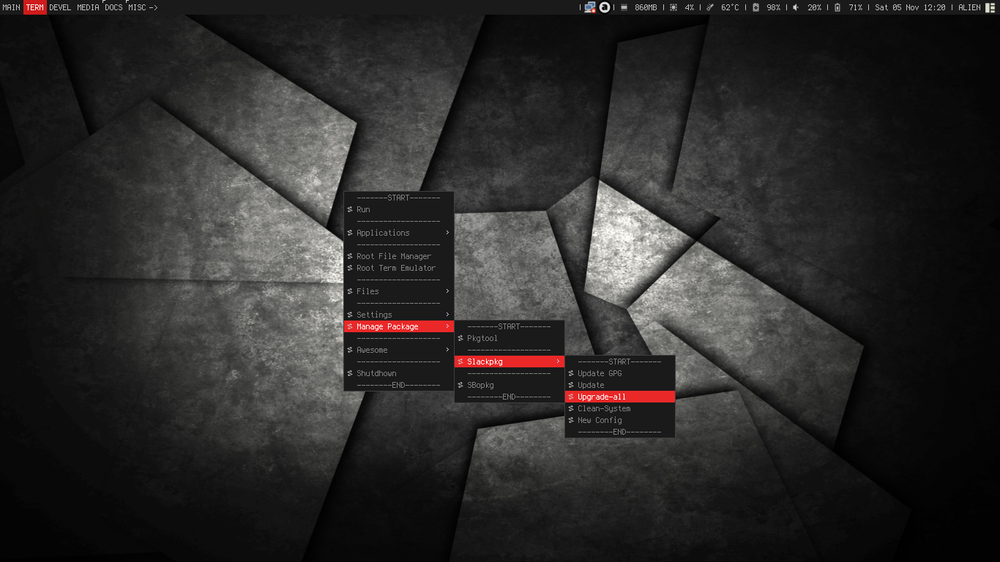

# awesome-config
This is my personal config for DE awesome on "slackware-current"

# Shortcut Key
"Print" "xfce4-screenshot"  
"Mod4+Z" "urxvt" --dropdown  
"Mod4+A" "audacious"  
"Mod4+Shift+A" "mocp" --terminal music player  
"Mod4+S" "pcmanfm"  
"Moc4+Shift+S" "mc" --terminal file manager  
"Mod4+Enter" "urxvt"  
"Mod4+Q" "firefox"  
"Mod4+E" "geany"  
"Alt+F2" "gmrun"  
"Alt+F3" "dmenu_run -b" --"b" on bottom  

# Startup
"nm-applet"  
"compton"  

# Screenshot

